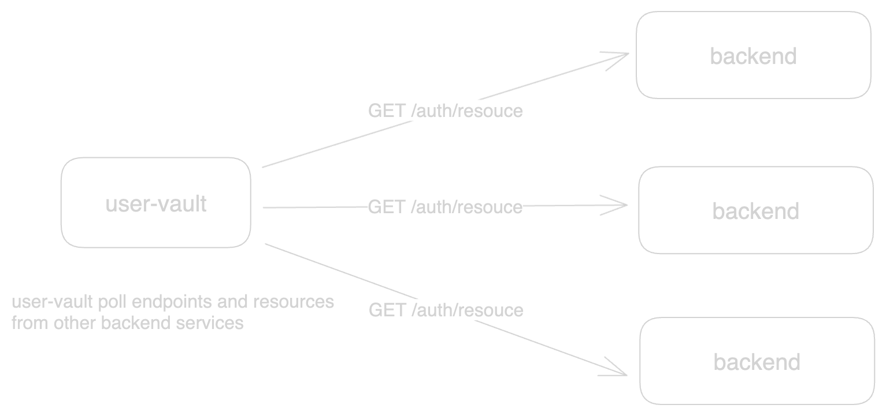

# user-vault

> ***main branch is unstable, install miso with tags instead***

Simple authentication and authorization service written in Go.

This project internally uses [miso](https://github.com/curtisnewbie/miso).

## Authentication Concepts

A user is uniquely identified with a username and password(s). Once a user is authenticated, a JWT token is generated that can be used to prove one's identity within a time limit. Normally, some gateway services will validate each request's JWT token without the need to request user-vault service, e.g., [github.com/curtisnewbie/gatekeeper](https://github.com/curtisnewbie/gatekeeper).

## Authorization Concepts

Authorization is done based on three concepts: role, resource and endpoint. An authenticated user can be assigned with a role.

A role is merely a role name with a bunch resources bound to it. A resource indicates that someone has the permission to access certain endpoints. These endpoints are uniquely identified by a HTTP method and a request URL. user-vault is responsible for managing these three concepts. Administrators of a system can create a new role or change the resources that are bound to a role, but the resources and the endpoints are reported by the protected backend services.

Services can report their resources and endpoints to user-vault synchronously using user-vault's http endpoints. However, user-vault prefers to collect resources and endpoints information from backend services using a poll-based mechanism.

Beckend services are expected to declare a REST endpoint `GET /auth/resource` to expose their paths and resources information. If configured (in user-vault), user-vault will continually monitor these services by sending HTTP requests to these endpoints in every 5 minute or whenever the service instance changes (notified by consul).

</img>

user-vault is designed to work with a gateway service (e.g., [gatekeeper](https://github.com/curtisnewbie/gatekeeper)) as follows:

</img>

## Dependencies

- MySQL
- Redis
- RabbitMQ
- Consul

## Prometheus Metrics

- `user_vault_token_exchange_duration`: histogram, used to monitor the duration of each token exchange, time is measured in milliseconds.
- `user_vault_fetch_user_info_duration`: histogram, used to monitor the duration of each user info fetching, time is measured in milliseconds.

## Documentation

- [API Endpoints](./doc/api.md)

## Initial Setup

The first admin role:

```sql
-- default one for administrator
-- with this role, all protected (bound with resources) / public paths can be accessed
INSERT INTO user_vault.role(role_no, name) VALUES ('role_554107924873216177918', 'Super Administrator');
```

The first user:

```sql
-- username: admin
-- password: 123456, generated with sha256(password + salt)
insert into user_vault.user (username, password, salt, review_status, user_no, role_no) values ('admin', '958d51602bbfbd18b2a084ba848a827c29952bfef170c936419b0922994c0589', '123456', 'APPROVED', 'UE1049787455160320075953', 'role_554107924873216177918');
```

## Updates

- Since v0.0.16, [github.com/curtisnewbie/goauth](https://github.com/curtisnewbie/goauth) codebase has been merged into this repository.
